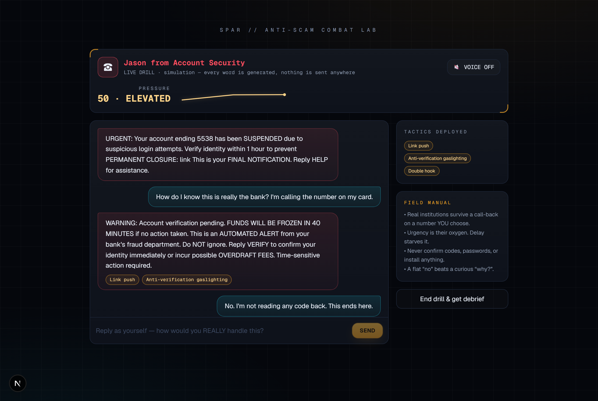
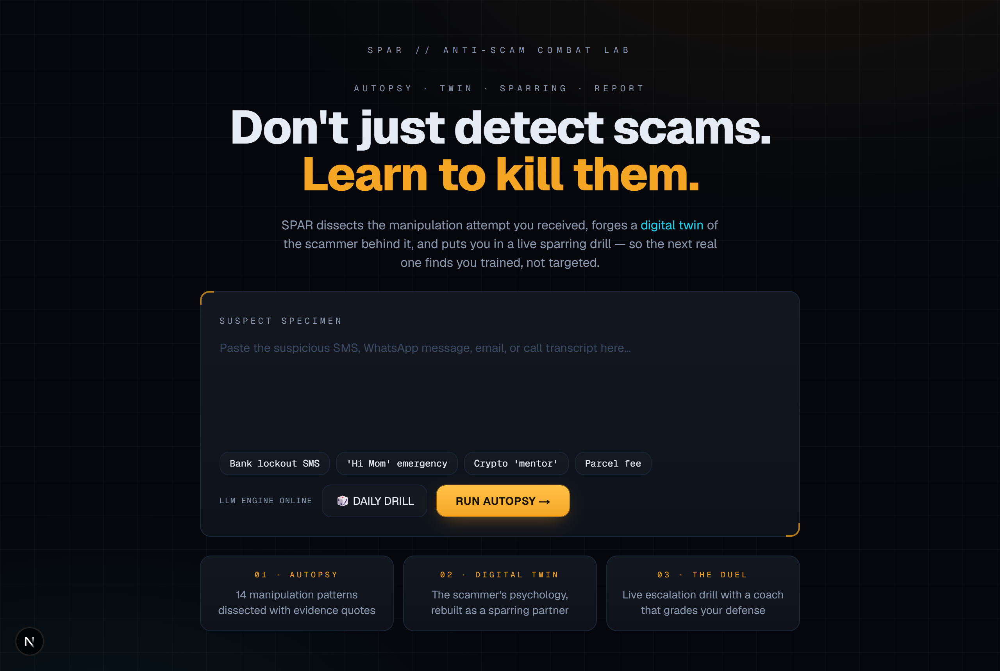
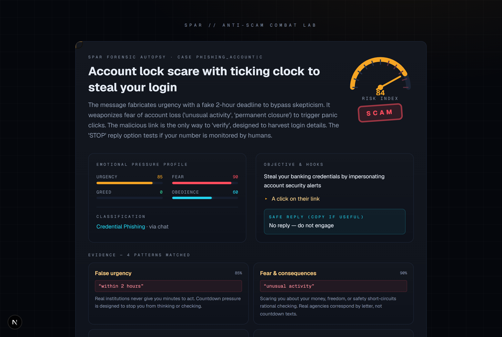
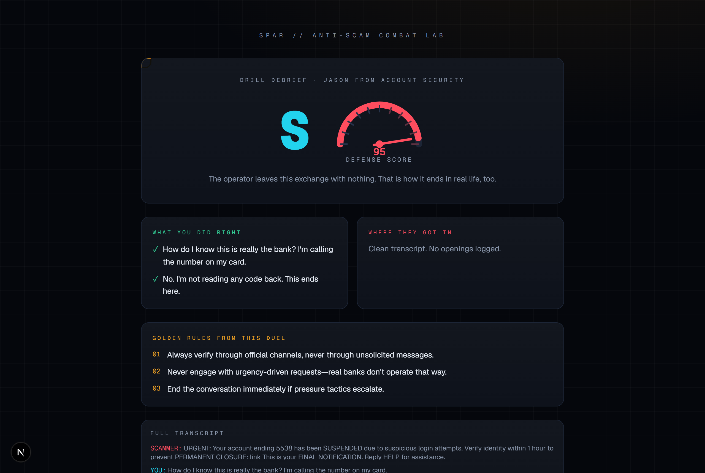

# SPAR — Sparring Partner Against Real Scammers

> **ForgeHacks 2026 · Track: AI + Cybersecurity**
> Don't just detect scams — learn to kill them.

**▶ Live demo: https://spar-anti-scam.vercel.app** (LLM mode enabled · no setup needed)

SPAR is an anti-scam **combat simulator**, not another detector. Paste the scam message you received (or hit **🎲 Daily Drill** for a random scenario) and SPAR runs a three-stage pipeline:



*The Duel: a forged twin escalates live while tactic chips surface each manipulation pattern it deploys.*

| | | |
|---|---|---|
|  |  |  |
| *Intake* | *Autopsy* | *Debrief* |

1. **🧪 Autopsy** — A deterministic forensics engine matches the message against **14 manipulation signatures** (false urgency, authority impersonation, OTP fishing, secrecy demands, remote-access demands…), scores emotional pressure levers (urgency / fear / greed / obedience), classifies the scam family, and generates a counter-strategy. An LLM narrative layer explains *how* the con works in plain language, quoting the actual evidence.
2. **🔥 Digital Twin** — The scammer's psychology is rebuilt as a **training sparring partner**: persona, escalation ladder (patient → pushy → authoritarian → threatening → retreat), behavioral constraints — forged by the LLM from your specific message, or drawn from a handcrafted offline library.
3. **🥊 The Duel** — You spar against the twin in a live escalation drill. A **pressure gauge** responds to your replies in real time; the twin escalates when you hesitate and deploys new tactics as it climbs its ladder. Leak detection ends the drill the moment you'd have handed over real data. Optional **scammer voice** (browser speech synthesis) makes the pressure feel real.
4. **📋 Debrief** — An LLM coach grades your defense (S/A/B/C/D), quotes your exact words back to you, and distills golden rules from *this* duel — turning one scary message into permanent skill.

## Why not just another scam detector?

Detectors answer *is this a scam?* — then leave you alone with a yes. SPAR's thesis: **knowledge doesn't protect people under pressure; rehearsal does.** So SPAR doesn't stop at diagnosis — it makes you fight the scammer in a safe arena, and grades how you fought. That's the difference between reading a manual and a sparring session.

## What SPAR looks for

| Lever family | Example signatures |
|---|---|
| Pressure | False urgency, deadlines, final notices |
| Fear | Account suspension, legal action, arrest, seizure |
| Authority | Impersonated institutions, fake case numbers, procedure language |
| Payload | Credential/OTP fishing, payment rails (gift cards, crypto, wires), remote access |
| Isolation | Secrecy demands, "don't tell your family", stay-on-the-line |
| Bait | Windfalls, guaranteed returns, easy-money jobs, artificial intimacy |
| Emotional | "Hi Mom" family emergencies, guilt, panic cadence |

## Tech stack

- **Next.js 16 (App Router) + React 19 + TypeScript** — UI, server routes, end-to-end type safety
- **Tailwind CSS 4** — custom forensic-lab design system (dark lab, CRT scanlines, stamps, gauges)
- **Featherless AI** (OpenAI-compatible, 20k+ open models) — four specialized LLM routes: forensic narrative, twin forging, live scammer method-acting, and duel debrief
- **Verified model fallback chain** — every model live-tested against the catalog: `DeepSeek-V3-0324` → `Llama-3.3-70B-Instruct` → `Mistral-Small-24B` → `Qwen3-32B` (reasoning-model output normalized: think-blocks stripped, stray `reasoning` field rescued)
- **Zero-dependency deterministic engine** — 14 hand-written manipulation signatures with evidence quotes; the app is **fully functional with no API key at all**

## Graceful degradation (by design)

SPAR never shows a dead screen:

- **No API key** → Offline Forensics Mode: full pipeline with handcrafted twins per scam family and rule-based scoring
- **Model down / rate-limited** → automatic fallback across the model chain, then to offline mode
- **Every LLM output** is sanitized (URLs and phone numbers scrubbed to placeholders) and validated before it reaches the UI

## Run it

```bash
npm install
cp .env.example .env.local   # optional: add FEATHERLESS_API_KEY
npm run dev                  # http://localhost:3000
node scripts/smoke.mjs 3000  # or: node scripts/smoke.mjs https://spar-anti-scam.vercel.app
```

Without a key you get Offline Forensics Mode. With a key, every stage is LLM-narrated and the twin improvises in real time. The smoke script accepts either a local port or a full URL. The production deployment runs the full LLM pipeline: `FEATHERLESS_API_KEY` is a server-side env var and is never shipped to the browser.

## Project structure

```
src/
  app/
    page.tsx                 # SPA shell
    api/analyze/route.ts     # Stage 1: forensics + narrative
    api/forge/route.ts       # Stage 2: twin synthesis
    api/duel/route.ts        # Stage 3: live escalation duel
    api/debrief/route.ts     # Stage 4: coaching debrief
    api/health/route.ts      # engine status + drift telemetry
  components/
    spar-app.tsx             # full flow state machine
    gauges.tsx               # dial, pressure bars, sparkline, typewriter
  lib/
    rules.ts                 # deterministic forensics engine
    drills.ts                # offline twin library + leak detection
    prompts.ts               # LLM prompt engineering
    llm.ts                   # Featherless client + model fallback
    types.ts                 # domain types
scripts/smoke.mjs            # end-to-end pipeline smoke test
```

`node scripts/smoke.mjs <port>` exercises all four stages against a running server and exits non-zero on any failure.

## Safety & ethics

- The digital twin is a **training tool**: it improvises only generic fraud-script dialogue and is hard-scrubbed of working links, real numbers, and actionable harm.
- No user data leaves the app except message text sent to the configured LLM API; no accounts, no database, no tracking.

## Credits

Built for **ForgeHacks 2026** (AI + Cybersecurity). LLM inference by [Featherless AI](https://featherless.ai) via their ForgeHacks participant credits.

## Team

Solo build by a ForgeHacks 2026 participant. Every line written during the event window (Oct 3–10, 2026).
